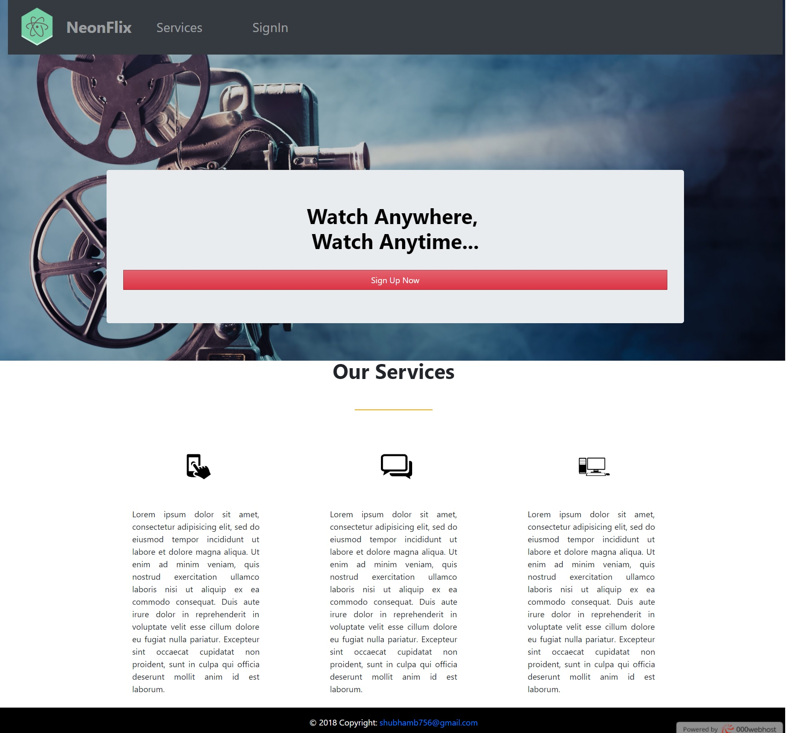
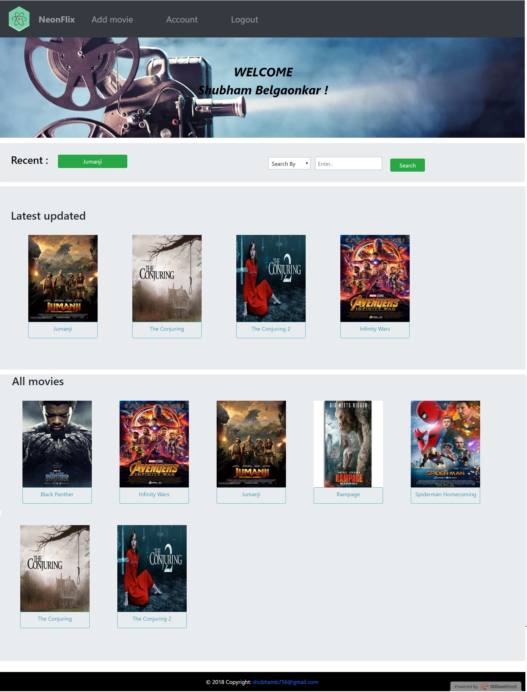
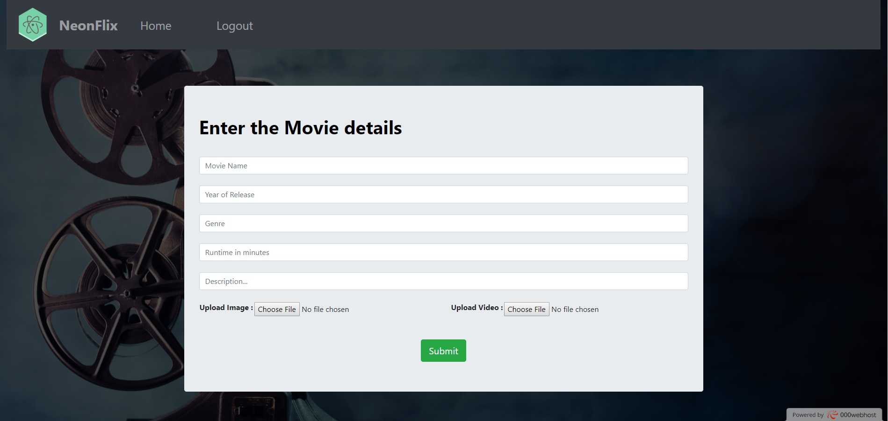
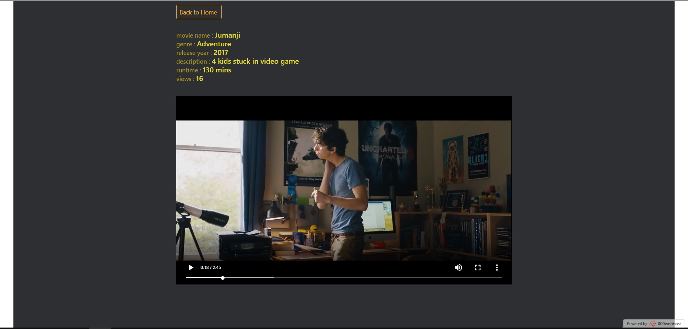
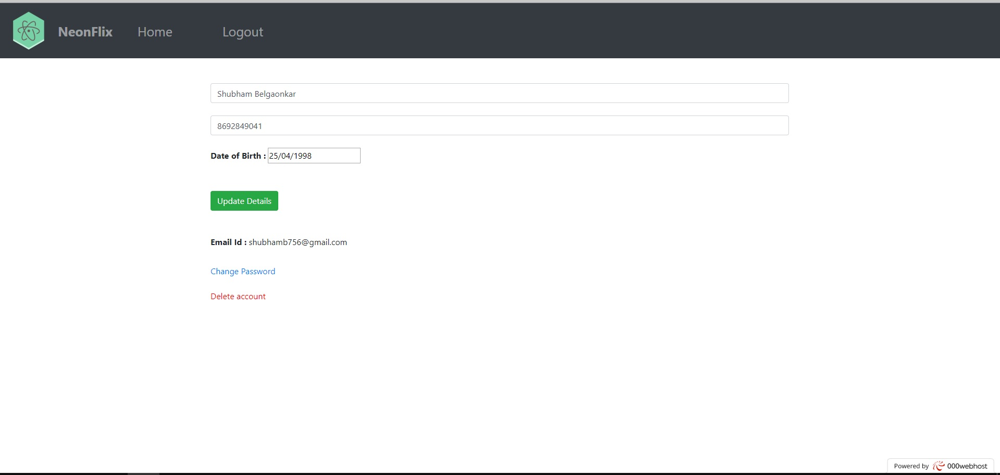

<div align="center">


# 🎬 OnlineMovieStreaming

### Plataforma web de streaming de películas y videos 🚀

<p align="center">
  <b>OnlineMovieStreaming</b> es una aplicación web desarrollada para visualizar, administrar y compartir películas y videos online, incorporando sistema de usuarios, panel administrativo y gestión multimedia completa.
</p>

<p align="center">
  
  
  
  
</p>

<p align="center">
  <a href="#-preview">Preview</a> •
  <a href="#-características">Características</a> •
  <a href="#-panel-admin">Admin</a> •
  <a href="#-tecnologías-utilizadas">Tecnologías</a> •
  <a href="#-instalación">Instalación</a>
</p>

</div>

---

# 🌌 Acerca de OnlineMovieStreaming

**OnlineMovieStreaming** es una plataforma web enfocada en el streaming de películas y videos online, permitiendo administrar contenido multimedia mediante un panel de administración completo.

La plataforma permite:

- 🎬 Ver películas y videos online
- 🔍 Buscar contenido multimedia
- 📈 Mostrar videos más vistos
- 🆕 Visualizar contenido reciente
- 👤 Sistema de autenticación
- ⚙️ Panel administrador
- ☁️ Gestión de uploads multimedia

El proyecto fue desarrollado para practicar:

- PHP
- MySQL
- Bootstrap
- Sistemas multimedia
- CRUD de usuarios
- Gestión de videos
- Desarrollo Full Stack

---

# 📸 Preview

## 🏠 Homepage

<div align="center">



</div>

---

## ⚙️ Panel Administrador

<div align="center">



</div>

---

## 🎬 Agregar Películas

<div align="center">



</div>

---

## 🎥 Página de Película

<div align="center">



</div>

---

## 👤 Detalles de Cuenta

<div align="center">



</div>

---

# ✨ Características

## 👤 Sistema de Usuarios

- 🔐 Registro de usuarios
- 🔑 Inicio de sesión
- 📝 Actualización de perfil
- ❌ Eliminación de cuentas
- ⚡ Gestión de autenticación

---

## 🎬 Streaming Multimedia

- ▶️ Reproducción de películas
- 🎥 Streaming de videos
- ⚡ Navegación rápida
- 📱 Interfaz responsive
- 🎞️ Gestión multimedia

---

## 🔍 Sistema de Búsqueda

- 🔎 Buscar películas
- 🎬 Buscar videos
- ⚡ Resultados dinámicos
- 📚 Exploración multimedia
- 🎥 Filtros rápidos

---

## 📈 Contenido Destacado

- 🔥 Videos más vistos
- 🆕 Últimos contenidos
- 🎞️ Recomendaciones
- 📊 Ordenamiento multimedia
- ⚡ Actualizaciones dinámicas

---

# ⚙️ Panel Admin

## 👑 Control Administrativo

El primer usuario registrado obtiene permisos de administrador.

### Funciones del administrador

- 🎬 Subir películas
- 🖼️ Gestionar posters
- 🎥 Subir videos
- 🗂️ Administrar contenido
- 👥 Gestionar usuarios

---

## ☁️ Gestión Multimedia

- Upload de imágenes
- Upload de videos
- Gestión de posters
- Administración multimedia
- Control de contenido

---

# 🛠️ Tecnologías Utilizadas

## 💻 Frontend

<p>
  
</p>

- HTML5
- CSS3
- Bootstrap
- JavaScript

---

## ⚙️ Backend & Database

<p>
  
</p>

- PHP
- MySQL
- SQL
- CRUD System

---

# 📂 Estructura del Proyecto

```bash
PlataformaWebStreamingPeliculas/
│
├── uploads/                 # Posters e imágenes
├── video-uploads/           # Videos multimedia
├── sql-files/               # Base de datos SQL
├── scrshots/                # Capturas
├── css/                     # Estilos
├── js/                      # Scripts
├── dbh.php                  # Configuración DB
├── index.php
└── README.md
```

---

# ⚡ Instalación

## 1️⃣ Clonar repositorio

```bash
git clone https://github.com/isairey/PlataformaWebStreamingPeliculas
```

---

## 2️⃣ Configurar base de datos

- Importar archivos SQL
- Editar nombre de DB en:

```bash
dbh.php
```

---

## 3️⃣ Vaciar tablas

Después de importar:

```bash
TRUNCATE TABLE nombre_tabla;
```

---

## 4️⃣ Crear carpetas necesarias

### Carpeta para posters

```bash
uploads/
```

---

### Carpeta para videos

```bash
video-uploads/
```

---

## 5️⃣ Ejecutar servidor

Usar:

- XAMPP
- WAMP
- Laragon
- Apache + MySQL

---

# 📦 Configuración Multimedia

## 🎥 Tamaño máximo de videos

Por defecto:

```bash
2MB máximo
```

---

## ⚠️ Para archivos grandes

Modificar configuración PHP:

```ini
upload_max_filesize
post_max_size
```

---

# 🔥 Funcionalidades Técnicas

## ⚡ Sistema Multimedia

- Video uploads
- Streaming local
- Gestión de posters
- Content management
- Dynamic rendering

---

## 🗄️ Base de Datos

- Sistema usuarios
- CRUD multimedia
- Gestión admin
- Relación contenido
- Queries dinámicas

---

## 📱 UI Responsive

- Bootstrap layouts
- Responsive cards
- Mobile compatibility
- Dynamic components
- User-friendly interface

---

# 🧠 Objetivos del Proyecto

## 🎯 Aprender y practicar

- PHP Full Stack
- Streaming platforms
- CRUD systems
- MySQL databases
- Multimedia management
- Authentication systems
- Responsive design

---

# 📊 Roadmap

## 🚧 Próximamente

- ❤️ Sistema favoritos
- ☁️ Cloud storage
- 🎞️ Categorías multimedia
- 📱 App móvil
- 🔥 Recomendaciones IA
- 🎧 Reproductor avanzado
- 🌙 Dark Mode
- 🚀 Optimización streaming

---

# 🤝 Contribuciones

Las contribuciones son bienvenidas ❤️

## Cómo contribuir

1. Haz Fork del proyecto
2. Crea una rama

```bash
git checkout -b feature/nueva-funcion
```

3. Realiza cambios
4. Haz commit

```bash
git commit -m "✨ Nueva funcionalidad"
```

5. Haz push

```bash
git push origin feature/nueva-funcion
```

6. Abre un Pull Request 🚀

---

# 👨‍💻 Autor

<div align="center">

## Isai Reyes Full Stack Streaming Developer

Apasionado por plataformas multimedia, aplicaciones streaming y desarrollo web moderno.

</div>

---

# 🌟 Apoya el Proyecto

Si te gusta OnlineMovieStreaming:

⭐ Dale una estrella al repositorio  
🍴 Haz Fork del proyecto  
📢 Compártelo con otros desarrolladores

---

# 📜 Licencia

Proyecto Open Source desarrollado con fines educativos y práctica Full Stack.

---

<div align="center">

### 🎬 OnlineMovieStreaming — Plataforma moderna para streaming multimedia y gestión de películas online.

</div>
